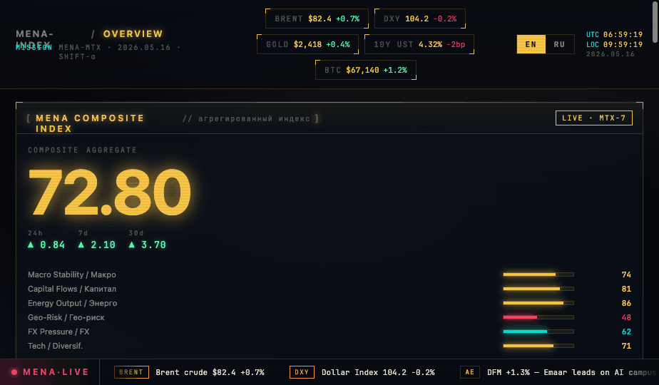

# Индекс инвестиционного климата стран MENA



> Исследовательский прототип для сравнения инвестиционного климата 19 стран MENA по открытым макроэкономическим и институциональным данным.

## Кратко

Проект собирает открытые данные World Bank, WGI и IMF в панель по **19 странам MENA за 2000–2024 годы**, формирует семь факторных индексов и рассчитывает композитный рейтинг CICI. Реализованы ETL, панельная регрессия, анализ чувствительности методом Монте-Карло, бэктест и интерактивный интерфейс Dash.

**Статус: исследовательский прототип, а не готовый инвестиционный рейтинг.** Технический конвейер завершён, но прогностическая проверка не пройдена: коэффициент Спирмена ρ на тестовом периоде равен **0,122** при целевом уровне 0,75. Поэтому рейтинг подходит для разведочного сравнения и проверки гипотез, но не для инвестиционных решений.

## Бизнес-задача

Собрать разрозненные макроэкономические и институциональные показатели в воспроизводимую систему сравнения стран, показать сильные и слабые факторы и проверить, насколько итоговый индекс согласуется с последующими потоками прямых иностранных инвестиций.

## Основные результаты

| Результат | Значение |
|---|---:|
| Страны | 19 |
| Период | 2000–2024 |
| Наблюдения «страна — год» | 475 |
| Факторные индексы | 7 |
| Симуляции Монте-Карло | 5 000 |
| Наблюдения в бэктесте | 83 |
| Spearman ρ, 2019–2023 | 0,122; p = 0,2715 |
| Pearson r, 2019–2023 | 0,269; p = 0,014 |

Рейтинг модели за 2024 год:

| Место | Страна | CICI |
|---:|---|---:|
| 1 | UAE | 88,42 |
| 2 | Qatar | 77,09 |
| 3 | Bahrain | 73,58 |
| 4 | Oman | 67,68 |
| 5 | Kuwait | 64,79 |

Моделирование методом Монте-Карло показывает устойчивость первой пятёрки к изменению весов в заданном диапазоне. Однако устойчивость внутренней формулы не означает внешнюю прогностическую валидность — бэктест это не подтвердил.

## Вывод и применение

- Индекс можно использовать как **разведочный инструмент первичного отбора** для сравнения факторов стран.
- Перед реальным применением необходимо пересмотреть целевую переменную, лаги, пропуски, факторы и схему проверки вне обучающей выборки.
- Нельзя интерпретировать верхнюю позицию как инвестиционную рекомендацию.
- Слабый бэктест — содержательный результат проекта: он показывает границу применимости модели, а не скрывается за красивым интерфейсом.

## Дашборд

Приложение Dash содержит карточку страны, рейтинг, карту, веса факторов, сравнение рынков, корреляции и ленту новостей. Скриншот выше демонстрирует интерфейс; статическая версия находится в [`frontend/MENA-INDEX.html`](frontend/MENA-INDEX.html).

## Данные

| Источник | Использование |
|---|---|
| World Bank WDI | макроэкономика, открытость, энергетика, человеческий капитал, финансы |
| World Governance Indicators | институты и политическая стабильность |
| IMF WEO | макроэкономические показатели |
| World Bank security indicators | прокси безопасности: homicide rate и military expenditure |

Готовые аналитические таблицы находятся в [`data/final`](data/final). Сырые данные загружаются повторно pipeline и не хранятся в Git.

## Проверки качества данных

- Полная сетка `19 стран × 25 лет = 475` наблюдений.
- Уникальность ключа `(iso3, year)` проверяется на уровне панели.
- Индикаторы приводятся к единому направлению и нормируются в диапазон 0–100.
- Выбросы ограничиваются 1-м и 99-м перцентилями до нормализации.
- Пропуски заполняются последовательно: интерполяция внутри страны, медиана страны, затем доступный общий fallback.
- Моделирование Монте-Карло проверяет чувствительность рейтинга к весам.
- Бэктест вне обучающей выборки за 2019–2023 годы фиксирует слабую внешнюю валидность.

## Методология

1. ETL загружает индикаторы из API и приводит их к ключу `(iso3, year)`.
2. Компоненты группируются в семь факторов: институты, макроэкономика, открытость, энергетика, безопасность, человеческий капитал и финансы.
3. Факторы нормируются в 0–100.
4. Two-way Fixed Effects регрессия оценивает связь факторов с `FDI % GDP`; при слабой модели веса смешиваются с baseline.
5. CICI рассчитывается как взвешенная сумма факторов.
6. 5 000 Monte Carlo симуляций измеряют чувствительность рангов к весам.
7. Бэктест отделяет train 2000–2018 от test 2019–2023.

## Ограничения

- Бэктест не подтверждает заявленную predictive power индекса: Spearman ρ статистически незначим.
- Рейтинг зависит от выбора факторов, нормализации, заполнения пропусков и prior-весов.
- Показатели безопасности являются прокси World Bank, а не детальными event-level данными о конфликтах.
- Макроэкономические ряды пересматриваются источниками и имеют неодинаковое покрытие.
- Данные 2024 года могут быть неполными или оценочными.
- Корреляция индекса с FDI не устанавливает причинность и не учитывает конкретные сделки, риск-профиль и цены активов.

## Стек

`Python` · `pandas` · `NumPy` · `World Bank API` · `IMF API` · `linearmodels` · `statsmodels` · `SciPy` · `Plotly` · `Dash`

## Как запустить

```bash
git clone https://github.com/sureasguuds9-prog/MENA-INVESTMENT-INDEX.git
cd MENA-INVESTMENT-INDEX
python -m venv .venv
source .venv/bin/activate
pip install -r requirements.txt
python run_all.py
python -m src.dashboard.app
```

Отдельные этапы:

```bash
python run_all.py --phase etl
python run_all.py --phase model
python run_all.py --only panel reg cici mc bt
```

## Структура

```text
data/final/       итоговая панель, ranking, Monte Carlo и backtest
src/etl/          загрузка и подготовка источников
src/model/        факторы, регрессия, CICI, sensitivity и validation
src/dashboard/    интерактивный Dash-интерфейс
frontend/         статический интерфейс и скриншоты
run_all.py        единая точка запуска pipeline
```

## Материалы

- [Рейтинг 2024](data/final/ranking_2024.csv)
- [Monte Carlo](data/final/monte_carlo_results.csv)
- [Метрики бэктеста](data/final/backtest_metrics.csv)
- [Рассказ о проекте для интервью](docs/interview_story.md)
